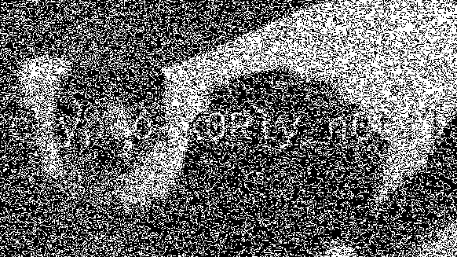

# Lemur XOR

I've hidden two cool images by XOR with the same secret key so you can't see them!

## Solving

Here we are given two images which are xored with the same key.

So we can xor the given images using

```python
from PIL import Image,ImageChops
flag = Image.open("flag.png").convert("1")
lemur = Image.open("lemur.png").convert("1")
result = ImageChops.logical_xor(flag,lemur)
result.show()
```

 So if we xor the given images we get 



We can see little bit but it is not clear because we converted it into b/w. 

So to get it xored with color I used Stegsolve Which gave me


## Flag

**crypto{X0Rly_n0t!}**